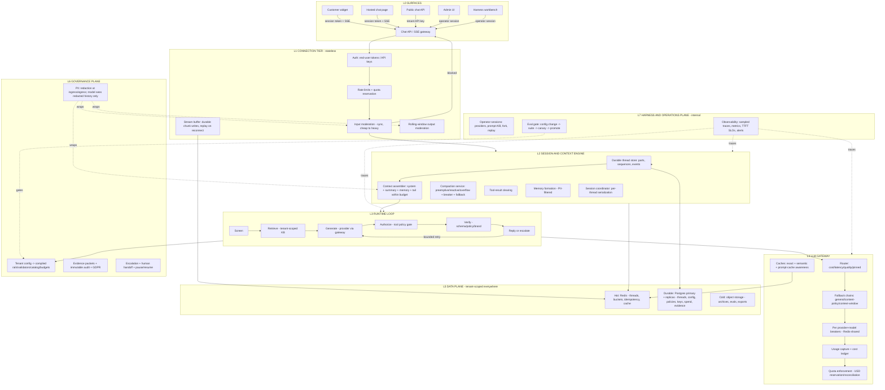

# Neryva Agent Studio - Hybrid Architecture v2

**Status:** Supersedes `docs/implementation/idea.md` (v1.1)
**Date:** August 2026
**Scope:** System architecture for Neryva as a multi-tenant chat product platform with an operator harness and a governance layer
**Grounding:** Every load-bearing pattern below is tied to a verified 2025-2026 source: the OpenCode V2 session specification, Anthropic's context-engineering documentation and compaction APIs, documented ChatGPT-scale system designs, and the LiteLLM/OpenRouter gateway references. Sources are listed in section 17. Where something is a design decision rather than a verified pattern, that is stated explicitly.

---

## 1. What this document is for

The v1.1 reference architecture treated Neryva as a control layer bolted onto a single chat widget. That is too narrow and does not match the product's actual shape. Neryva's competitors in behavior are not other guardrail vendors; they are the chat products users already know: a chat box, multiple conversation threads, history, compaction, and streaming at scale — with enterprise governance as the differentiator.

This architecture defines Neryva as a **hybrid of three proven systems**:

1. **Chat product platform** (the ChatGPT / Claude.com shape): chatbox UX, threads, history, compaction, token streaming, millions of end users.
2. **Agent harness** (the OpenCode shape): provider-agnostic connections, durable part-based sessions, session compaction, forking, tool loops, replay — used both as the runtime engine and as the operator workbench.
3. **Governance layer** (Neryva's existing core): tenant configuration, guardrails, PII handling, escalation, evidence, brand voice.

The binding insight, verified across all three reference systems: they share one engine — an **append-only session log, a context assembler that rebuilds the model-visible context every turn inside a token budget, and an SSE streaming runtime**. The differences are surfaces and policies. Neryva therefore builds **one session-and-context engine, two surfaces (per-tenant customer chat and the operator harness), and a governance plane wrapped around every request**.

The most important consequence is tenancy: **each tenant is a company that owns its own business data (knowledge bases, policies, brand, budgets) and its own end users (the company's customers, employees, or partners)**. All tenant data is isolated; end-user identity never crosses tenant boundaries; every row, cache key, vector namespace, trace, and ledger entry carries tenant context. Section 6 is the full treatment.

---

## 2. Design principles

1. **The engine is the session log, not the model.** Conversations are durable append-only logs; the model is a stateless executor rebuilt from the log on every turn.
2. **The model is not the product; the governance layer is.** Neryva works whether the tenant picks Claude, GPT, Gemini, or a compatible self-hosted provider.
3. **No single filter is a security boundary.** All guardrails are probabilistic. The system assumes bypass will happen and uses layered controls.
4. **Tenant isolation is a cross-cutting invariant, not a feature.** Resolved once at ingress; enforced in storage, cache, vector store, tracing, evals, and spend.
5. **Deny by default.** An unconfigured tenant or surface must refuse to serve, not serve without limits.
6. **Everything a model never needs to see is not sent to a model.** PII, tool-internal state, and superseded outputs are filtered at the context assembler, not trusted to the model.
7. **Deterministic checks before probabilistic ones.** Regex, policy, and allowlists run before classifiers and LLM judges.
8. **Authorization is separate from verification.** Verify is probabilistic quality (in scope, on brand). Authorize is deterministic permission (side-effect tool calls blocked unless the tenant config explicitly allows them). They never merge.
9. **Every stage is a test target.** Nothing ships without recurring adversarial testing; config changes pass an eval gate before promotion.
10. **Internal operator tooling is separate from the customer runtime.** OpenCode and the harness workbench are internal surfaces, behind the same policy, PII, and approval boundaries.

---

## 3. Reference foundations (verified, 2025-2026)

| Pattern | Source | What Neryva adopts |
|---|---|---|
| Durable event-sourced sessions, part-based messages, compaction checkpoint = summary + token-bounded tail, overflow-triggered one-shot compaction, per-session run coordinator, cursor pagination on aggregate sequence | OpenCode V2 session spec | The session and context engine (sections 7-8) |
| Compaction (whole-transcript), tool-result clearing (superseded outputs to placeholders), memory (structured notes outside the window); preemptive at ~70% of effective context, reactive at ~95%; snapshot-rollback atomic commit; breaker on compaction failures; lossy truncation fallback; instant background compaction; cache-preserving immutable summary blocks | Anthropic context-engineering docs, `compact_20260112`, `clear_tool_uses_20250919` | The context engineering stack (section 8) |
| SSE over HTTP with `Last-Event-ID` resume; stateless connection tier vs inference tier; single-writer Postgres primary + read replicas for append-only turn logs; Redis hot cache (recent turns + running summary); input moderation sync before routing; output moderation on a rolling token window; cancellation propagation upstream | Documented ChatGPT-scale system designs (HLD Handbook, systemdesign.one, sdeoffer, 2026) | The real-time path and data plane (sections 9, 11) |
| Gateway routing <30ms; per provider+model circuit breakers with Redis-shared state; fallback classes (general / content-policy / context-window); pre-first-byte failover only; Redis Lua quota reservation-and-reconciliation in USD; per-request cost ledger; org→team→user→key tenancy with budgets at each level | LiteLLM proxy architecture and production references (incl. the documented v1.48.0 Redis breaker-state fix) | The LLM gateway (section 10) and budget hierarchy (section 6) |
| Server-side stream buffering with replay on reconnect; dedup on request-id; per-thread sequence numbers; tool calls persisted as first-class blocks; cursor pagination; Redis→Postgres→archive tiering | qlaud threads API write-up; tianpan session-store article | Streaming durability and thread data model (sections 7, 9) |

---

## 4. Architecture overview



---

## 5. The two surfaces and the three planes

**Customer surfaces (per tenant):**
- Embeddable widget (web component, no iframe), talking to the platform with a short-lived end-user session token.
- Hosted chat page the tenant can point their own domain at — the "chatgpt.com for the tenant's users".
- Public chat API (OpenAI-compatible envelope) for tenants integrating their own apps.

**Operator surfaces (internal):**
- Admin UI: tenant config, knowledge management, model catalog policy, escalation queue, evals, spend.
- Harness workbench: provider connection testing, model comparison, prompt iteration and A/B, session forking, replay of sampled redacted traces, adversarial sweeps. Internal only; never serves customer traffic (AGENTS.md boundary).

**Three planes** wrap both surfaces: the runtime planes in sections 7-11 (engine, gateway, data), the governance plane in section 12, and the harness/operations plane in section 13.

---

## 6. Tenancy model — the full treatment

### 6.1 Hierarchy

```
Platform (Neryva operator)
  └── Tenant (a company: policies, knowledge, brand, budgets, users)
        └── Surface (widget / hosted page / API — each with its own config and persona)
              └── End user (the company's customer or employee; identity never crosses tenants)
```

- **Tenant** owns: tenant config (scope, brand voice, guardrail rules, escalation policy, model catalog policy, budgets), knowledge bases, brand assets, its own operator users with roles, API keys, webhook endpoints, spend ledger, audit and evidence records.
- **Surface** is a deployment of the agent with its own persona: a tenant can run a sales assistant and a support assistant simultaneously, each with different knowledge allowlists, tone, and tool allowlists, on the same engine.
- **End user** is scoped to exactly one tenant. Anonymous end users are identified by a per-tenant session token; authenticated end users by a tenant-issued customer ID. There is no global user table.

### 6.2 Data ownership matrix

| Data | Owner | Isolation boundary |
|---|---|---|
| Tenant config, policies, brand voice | Tenant | `tenant_id` on every config/policy row |
| Knowledge bases (documents, chunks, embeddings) | Tenant | Per-tenant vector namespace + knowledge allowlist per surface |
| Conversation threads and messages | End user (within the tenant) | `tenant_id` + end-user scoping on every read/write |
| End-user identity and preferences | End user | Per-tenant end-user table; no cross-tenant lookup |
| Session memory (compaction summaries, memories) | End user (within the tenant) | Stored under tenant + end-user keys; PII-filtered; opt-in |
| Spend, rate limits, budgets | Tenant (rolls up to platform) | Ledger rows carry tenant, surface, end-user |
| Evidence, audit, escalations | Tenant + platform | `tenant_id` scoped; platform-wide super-admin only |
| Provider credentials | Platform or tenant (BYOK) | Per-tenant secret records, never shared across tenants |
| Model catalog, pricing, platform config | Platform | Global, read-only for tenants |

### 6.3 Isolation primitives

1. **Tenant context resolution is a single, mandatory step** at the connection tier: every request resolves (tenant, surface, end-user) before anything else runs; every downstream component receives it as an immutable request field.
2. **Row-level isolation:** all tenant-owned tables carry `tenant_id` with composite indexes on `(tenant_id, ...)`; every repository query is tenant-scoped. Postgres Row-Level Security is the deployment-time enforcement layer for shared-schema deployments (defense in depth, not the primary control).
3. **Vector store isolation:** each tenant (and each of its knowledge bases) lives in its own namespace/partition. Retrieval additionally filters by the surface's knowledge allowlist.
4. **Cache isolation:** Redis keys are prefixed `tenant:{id}:...`; end-user-scoped keys add `end_user:{id}`. No key lookup without a prefix.
5. **Object storage isolation:** per-tenant prefixes; archive jobs and exports write only within the tenant's prefix.
6. **Trace isolation:** every trace and span carries tenant and surface; PII redaction runs before persistence; tenant-scoped dashboards and exports.
7. **Eval isolation:** test suites are per-tenant (the tenant's own scope/brand), run against the tenant's own (redacted) traces; results are tenant-scoped.
8. **Budget enforcement hierarchy:** platform > tenant > surface > end-user. A request is rejected when any level on its path is over budget; the check is a Redis Lua reservation-and-reconciliation in USD (section 10).
9. **Secret isolation:** tenant provider keys (BYOK) live in encrypted per-tenant secret records; no shared global key set (removes the current single-`.env`-key limitation). Platform-managed keys are separated from tenant-owned keys.
10. **Endpoint isolation:** operator endpoints reject tenant API keys; customer endpoints never accept operator credentials.

### 6.4 End-user model

- **Anonymous end users:** the widget issues a stable per-browser/per-device anonymous identity (local storage) and mints a short-lived session token from the platform. The session token, not a static API key, authenticates the chat stream (removes the current static-key-in-JS hole).
- **Authenticated end users:** the tenant's app exchanges its own auth state for a platform session token (OAuth/JWT exchange), so the platform never stores tenant passwords and never sees tenant auth infrastructure.
- **Multi-device continuity:** conversations are channel-based — the durable thread is keyed by end-user identity, not by connection; devices subscribe/unsubscribe freely.
- **Abuse limits:** per-end-user rate limits, spend caps, and concurrent-session limits, enforced in Redis, with platform-level bot detection at the widget edge.
- **Erasure:** end-user data is erasable on DSR (GDPR) without touching other end users of the same tenant; tenant offboarding erases or archives everything under the tenant's scope (section 14).

### 6.5 Deployment shapes

- **Default — shared control plane, isolated data plane:** one platform, one Postgres cluster (single-writer primary + read replicas), one Redis cluster, per-tenant namespaces everywhere. This is the L1/L2 shape below.
- **Enterprise option — dedicated tenant deployment:** a regulated tenant gets its own deployment (own DB, own vector store, own gateway), operated by the same control plane APIs. The architecture does not change; only the data-plane boundary moves. Data residency is satisfied by pinning a tenant (or its archive) to a region.
- **Data residency:** a tenant may be pinned to a region; the platform's multi-region shape keeps tenant writes in the tenant's region (regional primary + local replicas), with the archive in the tenant's region.

---

## 7. Session and context engine (the heart)

Adopted from the OpenCode V2 session model, adapted to multi-tenant Postgres.

### 7.1 Durable thread store

- **Thread = append-only event log.** Every mutation (message admitted, part updated, compaction committed, message removed) is a durable event with a monotonically increasing per-thread sequence number. The log is the source of truth; UI state is a projection.
- **Messages are composed of parts.** A message has a role (user, assistant, system, compaction) and parts of typed kinds: text, reasoning, tool_use, tool_result, citation, compaction, step. Tool calls and their results are first-class persisted blocks — this is the audit trail when an agent makes a wrong decision.
- **Live deltas vs durable events.** Token deltas streamed to the client are live-only fragments; they are not part of the replayable log until the turn completes (or is interrupted and recovered via the stream buffer, section 9). Replay and pagination always read the durable log.
- **Pagination and dedup.** History endpoints use cursor pagination on the durable sequence (`after`, `limit`, `hasMore`). Writes are deduplicated on request-id (idempotency key), so a client retry after a 5xx never double-writes.
- **Regeneration and editing are append-only.** A regenerated or edited turn is a new message referencing the original (ChatGPT-style); nothing is mutated in place. This keeps retries and audits consistent.
- **Fork.** Any thread can be forked at a message boundary (OpenCode fork); the operator harness uses this for debugging and prompt iteration; customer surfaces use it for "regenerate".

### 7.2 Session coordinator

A per-thread serialization primitive (equivalent to OpenCode's `SessionRunCoordinator`): at most one in-flight generation per thread; concurrent messages to the same thread are queued in sequence order. This eliminates the current race where two simultaneous messages interleave history appends. Different threads run concurrently.

### 7.3 Storage layout

- Hot: Redis — active thread tail (last N turns + running summary block), TTL aligned to session timeout; promoted on read.
- Durable: Postgres — thread metadata, message parts, compaction events, sequence numbers. Writes are append-only and low-throughput relative to reads, which is exactly the workload a single-writer primary with read replicas serves (the ChatGPT-scale finding; section 11).
- Cold: object storage — threads archived after a tenant-configurable window (default 30-90 days), restorable on demand.

---

## 8. Context engineering stack

Adopted from Anthropic's three primitives and OpenCode V2's compaction spec.

### 8.1 Context assembler

Every turn, the assembler builds the model-visible request inside the model's context budget:

```
system  (tenant config + brand voice + policy + tool schemas)     [stable prefix]
summary block   (immutable; updated only at compaction boundaries) [stable prefix]
memory block    (tenant- and end-user-scoped facts; opt-in)
recent tail     (last turns within budget, newest first)
retrieved knowledge (tenant KB, allowlist-filtered, spotlighted)
current user message
```

- Assembly is a single testable component (the `SessionContextLoader` pattern): nothing else touches history.
- **History served to the model always comes from the redacted column.** The engine stores both raw and redacted message content; the assembler only ever reads redacted content. This closes the current hole where prior turns reintroduce PII into the provider prompt.
- Token estimation is heuristic (OpenCode's 4-characters-per-token default) with per-model context sizes from the catalog.

### 8.2 Compaction

- **Triggers:** preemptive at ~70% of effective context; reactive at ~95%; provider-overflow-triggered one-shot recovery when the provider rejects the request (retry exactly once, then surface the failure).
- **Mechanics:** compact the head into a structured rolling summary (objective, key facts, decisions, pending work, next moves), retain a token-bounded serialized tail (`keep.tokens` default ~8000, `buffer` reserve ~20000, both per-tenant tunable). Summary generation uses a cheap summarizer model, tools disabled, bounded output tokens.
- **Atomicity:** snapshot → summarize against the snapshot → validate schema → atomic swap. A failed or interrupted compaction leaves the previous boundary active; the live buffer is never half-rewritten.
- **Cache discipline:** the summary block is written at a stable position (right after system) and treated as immutable for the next K turns, preserving the prompt-cache prefix. Full rewrites invalidate the cache; compaction therefore favors removing superseded content and appending immutable summary blocks.
- **Failure handling:** per-session circuit breaker on compaction (trip at 3 consecutive failures); when tripped, fall back to lossy truncation (keep system + recent K turns, drop the middle) and mark the session degraded. Wedged summarizer (buffer bigger than summarizer context): chunked-and-merge (summarize halves, then summarize the summaries).
- **Instant compaction:** summaries are refreshed in the background as the thread grows (background worker), so a triggered compaction is an instant swap, not a user-facing wait.

### 8.3 Tool-result clearing

A sub-transcript operation: superseded, re-fetchable tool results are replaced with short placeholders (keep the `tool_use` record, drop the payload). This is the safest high-frequency space reclaim and the primary defense against context bloat from agentic turns.

### 8.4 Memory (opt-in, tenant-gated)

- If the tenant enables it, a background memory worker extracts durable structured facts from closed turns (preferences, decisions, constraints) into a per-tenant, per-end-user memory store.
- Memory is PII-filtered, versioned, and retrievable; the tenant controls what memory the agent may read and when it expires.
- Memory is a retrieval step, not a raw dump: the assembler fetches top-k relevant facts on demand.

---

## 9. Request lifecycle and real-time path

### 9.1 The streaming path (the only path customers see)

1. **Connect.** Widget/chat page opens an SSE connection with a short-lived end-user session token. SSE is the transport (HTTP-native, `Last-Event-ID` reconnect, works through CDNs); WebSocket is the fallback for bidirectional needs. Proxy buffering is explicitly disabled (`X-Accel-Buffering: no`).
2. **Gate.** Connection tier authenticates the token, resolves (tenant, surface, end-user), checks rate limits and quota reservation.
3. **Input moderation (synchronous, before any model call):** regex fastpath → classifier → jailbreak scan → guardrail stack, cheap to heavy, per-tenant rails. A blocked input returns a hardcoded refusal with evidence emitted.
4. **Admit and persist.** The user message is durably admitted with a sequence number (request-id dedup makes retries safe).
5. **Assemble and route.** The context assembler builds the model-visible request; the gateway routes it (section 10).
6. **Generate and buffer.** Token deltas flow provider → gateway → connection tier. The connection tier does two things simultaneously: forwards deltas to the client, and appends them to the durable stream buffer.
7. **Rolling-window output moderation.** The stream is released through a small buffer window; chunks are validated as they pass (PII, policy, brand). A violation mid-stream emits a redaction/retraction event and truncates the stream. This replaces the current stream-then-validate hole: the customer never sees content that has not passed the window.
8. **Complete.** On turn completion, the durable message is finalized with usage tokens; the cost ledger and quota reconciliation run asynchronously; the webhook/event contract fires; the running summary is refreshed in the background.
9. **Reconnect.** If the connection drops, the client reconnects with `Last-Event-ID`; the connection tier replays the buffered durable chunks and continues the live stream. No half-finished message is lost (server-side buffering, qlaud pattern).
10. **Cancel.** Client disconnect propagates cancellation upstream — the gateway aborts the provider stream and releases capacity (no orphaned in-flight generations).

### 9.2 Non-streaming path

The API surface offers the same pipeline without deltas; full-output validation runs before the response is returned (with bounded re-ask, max N attempts, then escalate).

### 9.3 Failure semantics

- LLM call: per-call timeout, bounded retries, provider+model circuit breaker, then fallback chain (section 10); only after the chain is exhausted does the turn degrade (queue, escalate, or offline message capture — tenant-configurable).
- Guardrail layer failure: fail-closed for PII and policy layers; fail-open only where the tenant explicitly configures it and the layer is non-authoritative (classifier suggestions).
- Escalation: low-confidence, policy-blocked, or budget-exhausted turns route to human handoff with the full durable thread, attempted resolutions, and recommended next step (existing escalation service).

---

## 10. LLM gateway

A dedicated gateway service (LiteLLM/OpenRouter pattern), the only component that talks to providers.

- **Unified interface.** One adapter contract for chat, streaming, tool calls, and structured output across OpenAI, Anthropic, Gemini, Azure, and self-hosted endpoints; wire translation inside the gateway. The application never sees provider differences.
- **Routing.** Decision under ~30ms using per-deployment health, price, and latency tables; strategies per tenant: cost-based, latency-based, quality-pinned, or pinned model. Model catalog entries carry context-window size and price cards.
- **Tiered routing.** Simple queries route to the cheap model, complex to the capable model (the ChatGPT free-tier economics pattern), under tenant policy.
- **Fallback chains — three classes:** general (timeout/5xx), content-policy (provider refusal), context-window (overflow) — each with its own ordered target list. Failover is transparent only before the first byte; mid-stream failures surface to the connection tier.
- **Resilience.** Circuit breakers per provider+model with **state shared via Redis** (the documented LiteLLM v1.48.0 fix — per-replica breaker state is the #1 gateway incident), cooldowns on 429/5xx bursts, and connection pooling.
- **Usage capture.** Every call records input/output/reasoning tokens from the provider response — closing the current gap where `LLMResponse` carries no usage data.
- **Cost ledger.** Every request writes an append-only spend event (tenant, surface, end-user, model, provider, tokens, USD); consumers aggregate for billing, dashboards, and anomaly alerts.
- **Quota.** Redis Lua reservation-and-reconciliation in USD: reserve the estimated max spend before routing, reconcile against actual after completion; enforce at platform/tenant/surface/end-user levels.
- **Caching.** Exact-match cache and per-tenant semantic cache for FAQ-style traffic, invalidated when the tenant's knowledge changes; prompt-cache awareness (stable prefixes, `cache_control` markers) so the tenant's token bill stays low.

---

## 11. Data plane

- **Hot tier (Redis):** active thread tails and running summaries, token buckets, idempotency keys, semantic cache, gateway breaker state, quota counters. Redis is the shared coordination point that makes the connection tier and gateway stateless across replicas.
- **Durable tier (PostgreSQL):** single-writer primary + read replicas. Thread event logs, messages/parts, tenant configs, policies, API keys, spend, evidence, audit. Append-only conversation writes keep the primary load low; replicas serve history reads (the ChatGPT-scale finding: this workload does not need sharding until write saturation, then the turn log shards by tenant hash).
- **Cold tier (object storage):** archived threads (tenant-configurable window), eval datasets, GDPR exports, evidence exports. Region-pinned for residency.
- **Schema discipline:** ULID/sequence-based message ordering; vertical partitioning (thread metadata separate from message parts) so message writes are constant-cost regardless of thread length; composite indexes `(tenant_id, ...)` on every tenant table.

---

## 12. Governance plane (Neryva's existing core, unchanged responsibilities)

- **Tenant config is the product.** Versioned config compiles into: input rails, output validators, escalation policy, model catalog policy, tool allowlists, budgets, brand voice, knowledge allowlists — per surface. Config is versioned, reviewed, eval-gated, canary-able, and rollback-able (section 13). An unconfigured tenant/surface is denied by default.
- **PII handling rules (non-negotiable):**
  1. Redact at ingress (before anything is stored or sent).
  2. Redact at egress (rolling window).
  3. **The model context is assembled exclusively from redacted content** — history, knowledge, memory. Raw content is stored only for tenant/operator review and DSR, access-controlled.
  4. Traces, evals, replay corpora are redacted before persistence (existing rule, now enforced at the assembler boundary too).
- **Tool authorization gate.** Every side-effecting tool call passes a deterministic allowlist check derived from tenant config before execution; denials are audited; tool calls and results are persisted as first-class parts (section 7).
- **Evidence and audit.** Existing evidence packets on every guardrail/policy decision, immutable audit trail, GDPR export/erasure, escalation with pause/resume — all retained, now per tenant and per end-user scoped.

---

## 13. Harness and operations plane (internal only)

- **Operator sessions** (kind = internal): provider testing, model comparisons, prompt iteration and A/B, session forking, redacted-trace replay, garak/pyrith sweeps. The same session/context engine serves them; the boundary rules of AGENTS.md hold — operator sessions never serve customer traffic and never bypass runtime authorization.
- **Config change pipeline:** edit → validate schema → run tenant eval suite + adversarial sweep → canary (percentage of traffic) → promote → automatic rollback on regression. Every config version is immutable and revertible.
- **Observability:** traces (sampled; head sampling for errors/guardrail events), Prometheus/OTel metrics (TTFT, inter-token latency, guardrail hit rates, cost per conversation, compaction frequency), SLOs with alerting, and production quality monitoring (LLM-as-judge on sampled traffic, drift detection, automatic re-escalation).

---

## 14. Tenant lifecycle and compliance

- **Onboarding:** provision tenant, surfaces, end-user domain, vector namespaces, object prefixes, budgets, default deny config; mint operator keys.
- **In-life:** config changes flow through the eval gate; spend, quality, and guardrail metrics are tenant-scoped; tenant operators manage their own users/keys (delegated admin, LiteLLM pattern).
- **End-user DSR:** export or erase a single end user's threads, memory, and metadata without affecting other end users (GDPR).
- **Offboarding:** erase tenant data (config, knowledge, threads) or archive per tenant's contract; revoke keys; drop namespaces; retain audit and evidence per retention policy (existing TenantLifecycleService extended to the new data plane).
- **Regulatory posture:** EU AI Act (in force August 2026) — evidence logging, documented testing, human oversight via escalation, transparency disclosure to end users (bot notice); GDPR — DSR, retention, data minimization via redaction; residency pinning.

---

## 15. Scaling levels

- **L1 — validated product (next milestone):** the architecture above, one region, shared control plane, Postgres + Redis, gateway service, connection tier within the API service. Tens of thousands of concurrent end-user sessions.
- **L2 — proven product:** connection tier scaled as its own stateless fleet; read replicas; hot Redis tier; cold archive; connection-bound egress and cancellation propagation tuned. Millions of end users.
- **L3 — platform scale:** per-region single-writer primaries with replica fan-out, turn-log sharding by tenant hash when write saturation appears, self-hosted inference tier with KV-cache cancellation and continuous batching — only if Neryva runs its own GPUs. The data model is designed for L3 now so L1 does not require a rewrite.

---

## 16. Build plan (phased)

1. **Phase 1 — session engine and thread store.** Part-based message store with per-thread sequences, cursor pagination, request-id dedup; session coordinator; end-user session tokens (widget stops shipping static keys); redacted-only context assembly (closes the PII history hole).
2. **Phase 2 — context engineering.** Context assembler; compaction service (preemptive/reactive/overflow, breaker, truncate fallback, background instant compaction); tool-result clearing; per-thread summary blocks.
3. **Phase 3 — gateway.** Routing + tiering, fallback chains, Redis-shared breakers, usage capture, cost ledger, quota reservation/reconciliation, caches.
4. **Phase 4 — streaming durability and moderation.** Server-side chunk buffering, replay on reconnect, rolling-window output moderation, cancellation propagation.
5. **Phase 5 — governance at scale.** Tool authorization gate with persisted tool parts; per-tenant secrets; eval-gated config pipeline (canary/rollback); memory (opt-in); tenant lifecycle automation for the new data plane.
6. **Phase 6 — operations.** Metrics/SLOs/alerting, prod quality monitoring, per-tenant dashboards, cold archive automation.

---

## 17. Open risks and decisions

- **Streaming guardrail window latency:** rolling-window moderation adds a small release delay; the trade-off (latency vs safety) is a per-tenant knob.
- **Compaction quality is tenant-specific:** the summary prompt and keep/buffer values need tuning per tenant; bad compactions are a known failure mode (context rot at the moment of summarizing) and are surfaced to the operator, not silently accepted.
- **Gateway build vs adoption:** LiteLLM Proxy can serve as the gateway instead of building one; the decision hinges on data residency requirements and the per-tenant BYOK model. Either way, the gateway interface is the architecture's, not the tool's.
- **Semantic cache invalidation:** cache must be invalidated per tenant when knowledge or config changes; correctness here is a product promise and needs tests.
- **Multi-region is L2+, not L1:** residency pinning exists from L1 (region choice at onboarding), but active-active replication is deferred.
- **Memory (8.4) is opt-in:** it changes the agent's behavior and increases PII surface; it ships only with tenant consent, PII filtering, and erasure support.

---

## 18. Sources

**OpenCode (session architecture and compaction):**
- OpenCode V2 session specification — `specs/v2/session.md` (durable event-sourced sessions, context epochs, compaction checkpoint semantics, overflow-triggered recovery, run coordinator, replay/pagination contracts).
- OpenCode compaction documentation — `opencode.ai/v2/docs/compaction` (preflight estimation, `keep.tokens` 8000 / `buffer` 20000 defaults, one-shot overflow recovery, summary model constraints, lossy-but-durable semantics).
- OpenCode message model — `packages/opencode/src/session/message-v2.ts` and `session/compaction.ts` (part model: text/reasoning/tool/step/compaction; tool-result pruning; cursor pagination).

**Anthropic (context engineering):**
- Claude platform cookbook — "Context engineering: memory, compaction, and tool clearing" (compaction vs tool-result clearing vs memory; `compact_20260112`, `clear_tool_uses_20250919`).
- Claude platform docs — server-side compaction (trigger semantics, `pause_after_compaction`, compaction block streaming behavior).
- Claude cookbook — session memory compaction (instant/background compaction, prompt-cache sharing for summarization).
- Claude.com blog — session management and context (context rot, rewind, compact vs clear, subagents).

**Chat-scale platform design (2026 published designs):**
- HLD Handbook — "Design ChatGPT (Conversational AI at Scale)" (single-writer Postgres primary + ~50 read replicas, append-only turn logs, Redis hot cache, tiered model routing, rolling-window output moderation, SSE gateway/cancellation, proxy-buffering pitfalls).
- systemdesign.one — "ChatGPT System Design" (connection tier vs inference tier, SSE rationale, storage/bandwidth sizing).
- sdeoffer.com — "Design ChatGPT — an AI Chat Assistant at Scale" (stateless API tier vs GPU tier, LLM gateway responsibilities, TTFT, prefix caching, graceful degradation).
- tianpan.co — "Stateful Conversations at Database Scale" (tiered session storage, hot/persistent/cold, batch summarization vs memory formation, ULID vertical partitioning).
- qlaud.ai — "The hidden infrastructure you ship when you ship AI chat" (stream reassembly with server-side buffering, request-id dedup, per-thread sequencing, tool history as audit trail, cursor pagination).

**LLM gateway (2026):**
- LiteLLM proxy architecture docs (life of a request: auth/budget checks, rate limits, router, provider translation, async spend logging).
- LiteLLM multi-tenant architecture docs (org/team/user/key hierarchy, budgets per level, delegated administration).
- Markaicode — "LiteLLM Multi-Provider Architecture" (per provider+model circuit breakers, Redis-shared breaker state and the v1.48.0 fix, cooldown semantics, cost-based routing, sizing).
- Nerd Level Tech — "LiteLLM Proxy Production Tutorial" (fallback classes: general/content-policy/context-window, spend logs, budget durations).
- HLD Handbook — "Design a Model Router and Gateway" (routing decision budget, USD reservation-and-reconciliation quotas, cost ledger, pre-first-byte failover, RouteLLM/FrugalGPT tiered routing).

**Secondary reference:**
- Jatin Bansal — "Conversation Compaction" (preemptive vs reactive trigger discipline, snapshot-rollback atomicity, compaction circuit breaker, lossy truncation fallback, chunked-and-merge, cache-disruptive cost of rewrites).
- LangChain — "Context Engineering for Agents" (write/select/compress/isolate taxonomy; LangGraph short-term checkpointing and long-term memory).
