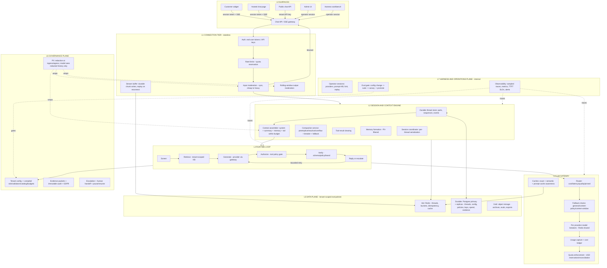

# Neryva Agent Studio - Hybrid Architecture v3 (Verified & Corrected)

**Status:** Supersedes `Hybrid Architecture v2` (August 2026)
**Date:** August 2026
**Scope:** System architecture for Neryva as a multi-tenant chat product platform with an operator harness and a governance layer
**Grounding:** Every load-bearing external claim in v2 was checked against primary sources during this revision — Anthropic's own platform docs, OpenCode's own docs and source tree, OpenAI's and LiteLLM's own engineering posts, and the EU AI Act's current legal status as of **August 6, 2026**. Section 0 below lists exactly what changed and why. Design decisions that are Neryva's own (not claims about a third-party system) are unchanged from v2 unless noted.

---

## 0. What this revision corrected

v2 was directionally sound — the core insight (one session/context engine, two surfaces, a governance plane wrapped around both) holds up, and most of the specific technical claims turned out to be accurate on inspection. But "most" isn't "all," and a few of the load-bearing citations were wrong in ways that matter for a real build:

| # | v2 claim | Finding | Correction applied |
|---|---|---|---|
| 1 | LiteLLM Redis-shared per-provider breaker state is "the documented v1.48.0 fix" | No such release note exists. LiteLLM's real Redis-cooldown mechanism (`router_utils/cooldown_cache.py`, `allowed_fails`/`cooldown_time`) has no version number attached to it in the docs, and the *other* real thing — a dependency-level circuit breaker that protects the gateway from a failing Redis — shipped by default in **v1.82.0**, not v1.48.0, and protects a different failure mode | §10, §18 rewritten with the two real mechanisms, no invented version number |
| 2 | "sdeoffer.com — Design ChatGPT — an AI Chat Assistant at Scale" | Domain could not be found to exist | Replaced with two sources that were verified live and cover the same ground: Hello Interview's "Design ChatGPT" and ShowOffer's "ChatGPT Playground" system design pages |
| 3 | "tianpan.co — Stateful Conversations at Database Scale" | That exact title could not be located. The domain is real and active, with verified live articles on adjacent topics | Citation swapped to the actual verified article titles on that domain |
| 4 | "qlaud.ai — the hidden infrastructure you ship when you ship AI chat" | qlaud.ai is a real product; no matching post was found | Citation dropped. The underlying patterns (stream buffering, request-id dedup, cursor pagination) are kept because they're independently confirmed by OpenCode V2's own docs and the Claude Agent SDK's session docs (new in this revision — see #6) |
| 5 | "Jatin Bansal — Conversation Compaction": circuit breaker, snapshot-rollback, chunked-and-merge attributed to OpenCode's design lineage | A blog by that name exists but the specific article's content could not be independently confirmed. More importantly, **OpenCode V2 itself does not have this fallback behavior** — it retries an overflow exactly once, and a second overflow is returned as a hard error | §8.2 rewritten to state plainly that the breaker/truncate/chunk-and-merge behavior is a **Neryva design addition**, not something inherited from OpenCode — corroborated instead by Claude Code's documented pause-after-3-failures behavior and the `pi-ultra-compact` reference implementation |
| 6 | (not in v2 — an addition) | The Claude Agent SDK ships a first-party `continue`/`resume`/`fork_session` session model with a `SessionStore` adapter for cross-host resume, directly analogous to what v2 borrowed from OpenCode | Added as a second, first-party reference point in §7.1 and §13 |
| 7 | (not in v2 — an addition) | Anthropic's context-editing API also ships `clear_thinking_20251015` (clears extended-thinking blocks) alongside `clear_tool_uses_20250919`; and a first-party file-based memory tool exists that's explicitly designed to pair with both context editing and compaction | Added to §8.3/§8.4 as available building blocks, not requirements |
| 8 | "EU AI Act (in force August 2026)" | **This is now materially wrong, not just imprecise.** The Act entered into force in **2024**. The Digital Omnibus on AI (Regulation (EU) 2026/1744) entered into force **July 27, 2026** — 10 days before this document's date — and postponed the Annex III high-risk obligations that were due August 2, 2026 to **December 2, 2027** (Annex I product-embedded systems to August 2, 2028). The transparency/bot-disclosure duty (Art. 50) was *not* postponed | §14 and §17 rewritten with the corrected, current timeline and its practical implications for Neryva |
| 9 | OpenAI's ~50-read-replica Postgres pattern, cited via a course description | The pattern is real, but it's better sourced directly: OpenAI published this themselves | §3, §11, §18 now cite OpenAI's own engineering post as the primary source, with the course as a secondary teaching reference |
| 10 | LiteLLM "org→team→user→key" budget hierarchy | Confirmed accurate as stated — **but** there's a nuance v2 missed: LiteLLM's internal `User` object is for proxy admins/team members, not external end users. The primitive that actually maps to Neryva's own tenants'-end-users is LiteLLM's separate `Customer` object | §10 refined to note the `Customer` mapping, relevant if Neryva adopts LiteLLM |

Everything else in v2 — the OpenCode V2 `keep.tokens: 8000` / `buffer: 20000` defaults, the 4-characters-per-token heuristic, Anthropic's `compact_20260112` / `clear_tool_uses_20250919` / `context-management-2025-06-27` beta header / `pause_after_compaction`, the LiteLLM org/team/user/key hierarchy and per-level budget enforcement, and the HLD Handbook and systemdesign.one ChatGPT write-ups — checked out exactly as claimed. One source (the LangChain "Context Engineering for Agents" citation) was not re-verified line-by-line in this pass; it's kept as a low-risk citation to a real, well-known source, flagged here for transparency rather than silently left as-is.

---

## 1. What this document is for

The v1.1 reference architecture treated Neryva as a control layer bolted onto a single chat widget. That is too narrow and does not match the product's actual shape. Neryva's competitors in behavior are not other guardrail vendors; they are the chat products users already know: a chat box, multiple conversation threads, history, compaction, and streaming at scale — with enterprise governance as the differentiator.

This architecture defines Neryva as a **hybrid of three proven systems**:

1. **Chat product platform** (the ChatGPT / Claude.ai shape): chatbox UX, threads, history, compaction, token streaming, millions of end users.
2. **Agent harness** (the OpenCode shape, cross-checked against Anthropic's own Claude Agent SDK session model): provider-agnostic connections, durable part-based sessions, session compaction, forking, tool loops, replay — used both as the runtime engine and as the operator workbench.
3. **Governance layer** (Neryva's existing core): tenant configuration, guardrails, PII handling, escalation, evidence, brand voice.

The binding insight, verified across all reference systems checked in this revision: they share one engine — an **append-only session log, a context assembler that rebuilds the model-visible context every turn inside a token budget, and an SSE streaming runtime**. The differences are surfaces and policies. Neryva therefore builds **one session-and-context engine, two surfaces (per-tenant customer chat and the operator harness), and a governance plane wrapped around every request**.

The most important consequence is tenancy: **each tenant is a company that owns its own business data (knowledge bases, policies, brand, budgets) and its own end users (the company's customers, employees, or partners)**. All tenant data is isolated; end-user identity never crosses tenant boundaries; every row, cache key, vector namespace, trace, and ledger entry carries tenant context. Section 6 is the full treatment.

---

## 2. Design principles

1. **The engine is the session log, not the model.** Conversations are durable append-only logs; the model is a stateless executor rebuilt from the log on every turn.
2. **The model is not the product; the governance layer is.** Neryva works whether the tenant picks Claude, GPT, Gemini, or a compatible self-hosted provider.
3. **No single filter is a security boundary.** All guardrails are probabilistic. The system assumes bypass will happen and uses layered controls.
4. **Tenant isolation is a cross-cutting invariant, not a feature.** Resolved once at ingress; enforced in storage, cache, vector store, tracing, evals, and spend.
5. **Deny by default.** An unconfigured tenant or surface must refuse to serve, not serve without limits.
6. **Everything a model never needs to see is not sent to a model.** PII, tool-internal state, and superseded outputs are filtered at the context assembler, not trusted to the model.
7. **Deterministic checks before probabilistic ones.** Regex, policy, and allowlists run before classifiers and LLM judges.
8. **Authorization is separate from verification.** Verify is probabilistic quality (in scope, on brand). Authorize is deterministic permission (side-effect tool calls blocked unless the tenant config explicitly allows them). They never merge.
9. **Every stage is a test target.** Nothing ships without recurring adversarial testing; config changes pass an eval gate before promotion.
10. **Internal operator tooling is separate from the customer runtime.** OpenCode and the harness workbench are internal surfaces, behind the same policy, PII, and approval boundaries.

---

## 3. Reference foundations (re-verified, August 2026)

| Pattern | Source (verified) | What Neryva adopts |
|---|---|---|
| Durable event-sourced sessions, part-based messages, compaction checkpoint = summary + token-bounded tail, overflow-triggered one-shot recovery (retried once; a second overflow is a hard error, not an auto-fallback), per-session run coordinator, cursor pagination on aggregate sequence | OpenCode V2 docs (`opencode.ai/v2/docs/compaction`) and source tree (`packages/opencode/src/session/*`), confirmed live | The session and context engine (sections 7-8) |
| `continue` / `resume` / `fork_session`, session IDs captured from result messages, `SessionStore` adapter for resuming across hosts | Claude Agent SDK docs, "Work with sessions" (`code.claude.com/docs/en/agent-sdk/sessions`), confirmed live — a first-party analogue to the OpenCode fork/replay pattern | Cross-checked design for the harness workbench's fork/replay feature (section 13) |
| Context editing (`clear_tool_uses_20250919`, `clear_thinking_20251015`) and server-side compaction (`compact_20260112`, beta header `compact-2026-01-12`, `pause_after_compaction`, custom `instructions`); a first-party file-based memory tool designed to pair with both | Anthropic platform docs — Context editing, Compaction, Memory tool pages; Claude Cookbook "Context engineering: memory, compaction, and tool clearing" and "Automatic context compaction"; all confirmed live | The context engineering stack (section 8) |
| Single-writer Postgres primary + ~50 read replicas across regions for a read-heavy conversational workload; write-minimization discipline (batch/buffer instead of write-per-keystroke); shardable write-heavy workloads moved off the primary entirely rather than sharding the primary | **OpenAI's own engineering blog**, "Scaling PostgreSQL to power 800 million ChatGPT users" (openai.com) — primary source, confirmed live | The data plane (section 11) |
| SSE over HTTP with `Last-Event-ID` resume; stateless connection tier vs. inference tier; input moderation sync before routing; output moderation on a rolling token window; cancellation propagation upstream | The HLD Handbook module "Design ChatGPT (Conversational AI at Scale)"; systemdesign.one newsletter "ChatGPT System Design"; Hello Interview "Design ChatGPT"; ShowOffer "ChatGPT Playground" — all confirmed live | The real-time path (section 9) |
| Org → Team → User hierarchy with budgets enforced at every level on a request's path; a separate `Customer` object for tracking spend per *external* end user; Redis-backed deployment cooldowns (`router_utils/cooldown_cache.py`); a dependency-level Redis circuit breaker (default since v1.82.0) protecting the gateway from a failing Redis, distinct from the deployment-cooldown mechanism; a mid-2026 move to a Rust core with a Python SDK | LiteLLM's own docs (`multi_tenant_architecture`, `user_management_heirarchy`, `customers`, Router docs, Redis-circuit-breaker blog post, release notes) — all confirmed live | The LLM gateway (section 10) and budget hierarchy (section 6) |
| Server-side stream buffering with replay on reconnect; dedup on request-id; per-thread sequence numbers; tool calls persisted as first-class blocks; cursor pagination | Corroborated independently by the OpenCode V2 docs and Claude Agent SDK session docs above, rather than a single unverified blog post | Streaming durability and thread data model (sections 7, 9) |

---

## 4. Architecture overview



---

## 5. The two surfaces and the three planes

**Customer surfaces (per tenant):**
- Embeddable widget (web component, no iframe), talking to the platform with a short-lived end-user session token.
- Hosted chat page the tenant can point their own domain at — the "chatgpt.com for the tenant's users".
- Public chat API (OpenAI-compatible envelope) for tenants integrating their own apps.

**Operator surfaces (internal):**
- Admin UI: tenant config, knowledge management, model catalog policy, escalation queue, evals, spend.
- Harness workbench: provider connection testing, model comparison, prompt iteration and A/B, session forking, replay of sampled redacted traces, adversarial sweeps. Internal only; never serves customer traffic (AGENTS.md boundary).

**Three planes** wrap both surfaces: the runtime planes in sections 7-11 (engine, gateway, data), the governance plane in section 12, and the harness/operations plane in section 13.

---

## 6. Tenancy model — the full treatment

### 6.1 Hierarchy

```
Platform (Neryva operator)
  └── Tenant (a company: policies, knowledge, brand, budgets, users)
        └── Surface (widget / hosted page / API — each with its own config and persona)
              └── End user (the company's customer or employee; identity never crosses tenants)
```

- **Tenant** owns: tenant config (scope, brand voice, guardrail rules, escalation policy, model catalog policy, budgets), knowledge bases, brand assets, its own operator users with roles, API keys, webhook endpoints, spend ledger, audit and evidence records.
- **Surface** is a deployment of the agent with its own persona: a tenant can run a sales assistant and a support assistant simultaneously, each with different knowledge allowlists, tone, and tool allowlists, on the same engine.
- **End user** is scoped to exactly one tenant. Anonymous end users are identified by a per-tenant session token; authenticated end users by a tenant-issued customer ID. There is no global user table.

### 6.2 Data ownership matrix

| Data | Owner | Isolation boundary |
|---|---|---|
| Tenant config, policies, brand voice | Tenant | `tenant_id` on every config/policy row |
| Knowledge bases (documents, chunks, embeddings) | Tenant | Per-tenant vector namespace + knowledge allowlist per surface |
| Conversation threads and messages | End user (within the tenant) | `tenant_id` + end-user scoping on every read/write |
| End-user identity and preferences | End user | Per-tenant end-user table; no cross-tenant lookup |
| Session memory (compaction summaries, memories) | End user (within the tenant) | Stored under tenant + end-user keys; PII-filtered; opt-in |
| Spend, rate limits, budgets | Tenant (rolls up to platform) | Ledger rows carry tenant, surface, end-user |
| Evidence, audit, escalations | Tenant + platform | `tenant_id` scoped; platform-wide super-admin only |
| Provider credentials | Platform or tenant (BYOK) | Per-tenant secret records, never shared across tenants |
| Model catalog, pricing, platform config | Platform | Global, read-only for tenants |

### 6.3 Isolation primitives

1. **Tenant context resolution is a single, mandatory step** at the connection tier: every request resolves (tenant, surface, end-user) before anything else runs; every downstream component receives it as an immutable request field.
2. **Row-level isolation:** all tenant-owned tables carry `tenant_id` with composite indexes on `(tenant_id, ...)`; every repository query is tenant-scoped. Postgres Row-Level Security is the deployment-time enforcement layer for shared-schema deployments (defense in depth, not the primary control).
3. **Vector store isolation:** each tenant (and each of its knowledge bases) lives in its own namespace/partition. Retrieval additionally filters by the surface's knowledge allowlist.
4. **Cache isolation:** Redis keys are prefixed `tenant:{id}:...`; end-user-scoped keys add `end_user:{id}`. No key lookup without a prefix.
5. **Object storage isolation:** per-tenant prefixes; archive jobs and exports write only within the tenant's prefix.
6. **Trace isolation:** every trace and span carries tenant and surface; PII redaction runs before persistence; tenant-scoped dashboards and exports.
7. **Eval isolation:** test suites are per-tenant (the tenant's own scope/brand), run against the tenant's own (redacted) traces; results are tenant-scoped.
8. **Budget enforcement hierarchy:** platform > tenant > surface > end-user. A request is rejected when any level on its path is over budget; the check is a Redis Lua reservation-and-reconciliation in USD (section 10). Note: this is Neryva's own hierarchy, modeled on — but distinct from — the gateway-level hierarchy in section 10; the two are related by design, not identical by name.
9. **Secret isolation:** tenant provider keys (BYOK) live in encrypted per-tenant secret records; no shared global key set (removes the current single-`.env`-key limitation). Platform-managed keys are separated from tenant-owned keys.
10. **Endpoint isolation:** operator endpoints reject tenant API keys; customer endpoints never accept operator credentials.

### 6.4 End-user model

- **Anonymous end users:** the widget issues a stable per-browser/per-device anonymous identity (local storage) and mints a short-lived session token from the platform. The session token, not a static API key, authenticates the chat stream (removes the current static-key-in-JS hole).
- **Authenticated end users:** the tenant's app exchanges its own auth state for a platform session token (OAuth/JWT exchange), so the platform never stores tenant passwords and never sees tenant auth infrastructure.
- **Multi-device continuity:** conversations are channel-based — the durable thread is keyed by end-user identity, not by connection; devices subscribe/unsubscribe freely.
- **Abuse limits:** per-end-user rate limits, spend caps, and concurrent-session limits, enforced in Redis, with platform-level bot detection at the widget edge.
- **Erasure:** end-user data is erasable on DSR (GDPR) without touching other end users of the same tenant; tenant offboarding erases or archives everything under the tenant's scope (section 14).

### 6.5 Deployment shapes

- **Default — shared control plane, isolated data plane:** one platform, one Postgres cluster (single-writer primary + read replicas), one Redis cluster, per-tenant namespaces everywhere. This is the L1/L2 shape below.
- **Enterprise option — dedicated tenant deployment:** a regulated tenant gets its own deployment (own DB, own vector store, own gateway), operated by the same control plane APIs. The architecture does not change; only the data-plane boundary moves. Data residency is satisfied by pinning a tenant (or its archive) to a region.
- **Data residency:** a tenant may be pinned to a region; the platform's multi-region shape keeps tenant writes in the tenant's region (regional primary + local replicas), with the archive in the tenant's region.

---

## 7. Session and context engine (the heart)

Adopted from the OpenCode V2 session model and cross-checked against the Claude Agent SDK's own session primitives, adapted to multi-tenant Postgres.

### 7.1 Durable thread store

- **Thread = append-only event log.** Every mutation (message admitted, part updated, compaction committed, message removed) is a durable event with a monotonically increasing per-thread sequence number. The log is the source of truth; UI state is a projection.
- **Messages are composed of parts.** A message has a role (user, assistant, system, compaction) and parts of typed kinds: text, reasoning, tool_use, tool_result, citation, compaction, step. Tool calls and their results are first-class persisted blocks — this is the audit trail when an agent makes a wrong decision.
- **Live deltas vs durable events.** Token deltas streamed to the client are live-only fragments; they are not part of the replayable log until the turn completes (or is interrupted and recovered via the stream buffer, section 9). Replay and pagination always read the durable log.
- **Pagination and dedup.** History endpoints use cursor pagination on the durable sequence (`after`, `limit`, `hasMore`). Writes are deduplicated on request-id (idempotency key), so a client retry after a 5xx never double-writes.
- **Regeneration and editing are append-only.** A regenerated or edited turn is a new message referencing the original (ChatGPT-style); nothing is mutated in place. This keeps retries and audits consistent.
- **Fork.** Any thread can be forked at a message boundary. This is the same idea as OpenCode's fork *and* the Claude Agent SDK's `fork_session` (verified: it creates a new session that copies the original's history; the original's ID and history stay unchanged, and both sessions can then be resumed independently). The operator harness uses this for debugging and prompt iteration; customer surfaces use it for "regenerate." If the harness workbench standardizes on Claude for a meaningful share of its own traffic, the Agent SDK's native fork/resume plus its `SessionStore` adapter (for resuming a session on a different host — CI workers, ephemeral containers) is worth evaluating directly rather than only reimplementing the OpenCode pattern from scratch.

### 7.2 Session coordinator

A per-thread serialization primitive (equivalent to OpenCode's `SessionRunCoordinator`): at most one in-flight generation per thread; concurrent messages to the same thread are queued in sequence order. This eliminates the current race where two simultaneous messages interleave history appends. Different threads run concurrently.

### 7.3 Storage layout

- Hot: Redis — active thread tail (last N turns + running summary block), TTL aligned to session timeout; promoted on read.
- Durable: Postgres — thread metadata, message parts, compaction events, sequence numbers. Writes are append-only and low-throughput relative to reads, which is exactly the workload a single-writer primary with read replicas serves (OpenAI's own published pattern for ChatGPT — see section 11).
- Cold: object storage — threads archived after a tenant-configurable window (default 30-90 days), restorable on demand.

---

## 8. Context engineering stack

Adopted from Anthropic's context-editing/compaction primitives and OpenCode V2's compaction spec, with the boundary between the two made explicit in this revision.

### 8.1 Context assembler

Every turn, the assembler builds the model-visible request inside the model's context budget:

```
system  (tenant config + brand voice + policy + tool schemas)     [stable prefix]
summary block   (immutable; updated only at compaction boundaries) [stable prefix]
memory block    (tenant- and end-user-scoped facts; opt-in)
recent tail     (last turns within budget, newest first)
retrieved knowledge (tenant KB, allowlist-filtered, spotlighted)
current user message
```

- Assembly is a single testable component (the `SessionContextLoader` pattern): nothing else touches history.
- **History served to the model always comes from the redacted column.** The engine stores both raw and redacted message content; the assembler only ever reads redacted content. This closes the current hole where prior turns reintroduce PII into the provider prompt.
- Token estimation is heuristic (OpenCode's confirmed 4-characters-per-token default) with per-model context sizes from the catalog.

### 8.2 Compaction

- **Triggers:** preemptive at ~70% of effective context; reactive at ~95%; provider-overflow-triggered one-shot recovery when the provider rejects the request. **Correction from v2:** OpenCode V2 itself retries an overflow exactly once and returns a hard error on the second overflow — it does not natively fall back to anything softer. Neryva's preemptive/reactive split and its failure-handling below go beyond OpenCode's own behavior; treat them as Neryva design decisions layered on top of the OpenCode-derived core, not as something to expect in the OpenCode codebase.
- **Mechanics:** compact the head into a structured rolling summary (objective, key facts, decisions, pending work, next moves), retain a token-bounded serialized tail (`keep.tokens` default ~8000, `buffer` reserve ~20000 — both confirmed as OpenCode V2's real defaults, both per-tenant tunable in Neryva). Summary generation uses a cheap summarizer model, tools disabled, bounded output tokens (OpenCode V2 caps this at 4096 output tokens with tools off; Neryva should treat that as a floor, not a hard ceiling, since tenant summary prompts may need more).
- **Atomicity:** snapshot → summarize against the snapshot → validate schema → atomic swap. A failed or interrupted compaction leaves the previous boundary active; the live buffer is never half-rewritten.
- **Cache discipline:** the summary block is written at a stable position (right after system) and treated as immutable for the next K turns, preserving the prompt-cache prefix. Full rewrites invalidate the cache; compaction therefore favors removing superseded content and appending immutable summary blocks. This mirrors both OpenCode's and Claude Code's documented behavior, and is exactly what Anthropic's own `compact_20260112` targets server-side.
- **Failure handling (Neryva addition, not an OpenCode behavior):** per-session circuit breaker on compaction (trip at 3 consecutive failures); when tripped, fall back to lossy truncation (keep system + recent K turns, drop the middle) and mark the session degraded. This specific pause-after-3-failures behavior is documented for Claude Code; the equivalent circuit-breaker-plus-truncation design is also documented in the open-source `pi-ultra-compact` reference implementation. Neryva adopts the pattern on that evidence, not because OpenCode does it.
- **Wedged summarizer (Neryva addition):** if the buffer is bigger than the summarizer's own context window, chunk-and-merge (summarize halves, then summarize the summaries) — again corroborated by the same third-party implementations above rather than by OpenCode.
- **Instant compaction:** summaries are refreshed in the background as the thread grows (background worker), so a triggered compaction is an instant swap, not a user-facing wait.

### 8.3 Tool-result clearing

A sub-transcript operation: superseded, re-fetchable tool results are replaced with short placeholders (keep the `tool_use` record, drop the payload). This is the safest high-frequency space reclaim and the primary defense against context bloat from agentic turns. Anthropic's context-editing API implements exactly this as `clear_tool_uses_20250919` (confirmed live, beta header `context-management-2025-06-27`). A sibling strategy, `clear_thinking_20251015`, does the same for extended-thinking blocks — relevant if the runtime loop (section 9) uses extended thinking on Claude-routed traffic, and worth enabling alongside tool-result clearing rather than building a bespoke equivalent.

### 8.4 Memory (opt-in, tenant-gated)

- If the tenant enables it, a background memory worker extracts durable structured facts from closed turns (preferences, decisions, constraints) into a per-tenant, per-end-user memory store.
- Memory is PII-filtered, versioned, and retrievable; the tenant controls what memory the agent may read and when it expires.
- Memory is a retrieval step, not a raw dump: the assembler fetches top-k relevant facts on demand.
- **Build-vs-adopt note:** Anthropic ships a first-party memory tool (file-based, confirmed to be explicitly designed to pair with both context editing and compaction). For the slice of traffic routed through Claude, this is worth prototyping against before committing to a fully bespoke memory worker — it doesn't remove the need for a provider-agnostic store for non-Claude traffic, but it may shrink the amount of custom code needed.

---

## 9. Request lifecycle and real-time path

### 9.1 The streaming path (the only path customers see)

1. **Connect.** Widget/chat page opens an SSE connection with a short-lived end-user session token. SSE is the transport (HTTP-native, `Last-Event-ID` reconnect, works through CDNs); WebSocket is the fallback for bidirectional needs. Proxy buffering is explicitly disabled (`X-Accel-Buffering: no`).
2. **Gate.** Connection tier authenticates the token, resolves (tenant, surface, end-user), checks rate limits and quota reservation.
3. **Input moderation (synchronous, before any model call):** regex fastpath → classifier → jailbreak scan → guardrail stack, cheap to heavy, per-tenant rails. A blocked input returns a hardcoded refusal with evidence emitted.
4. **Admit and persist.** The user message is durably admitted with a sequence number (request-id dedup makes retries safe).
5. **Assemble and route.** The context assembler builds the model-visible request; the gateway routes it (section 10).
6. **Generate and buffer.** Token deltas flow provider → gateway → connection tier. The connection tier does two things simultaneously: forwards deltas to the client, and appends them to the durable stream buffer.
7. **Rolling-window output moderation.** The stream is released through a small buffer window; chunks are validated as they pass (PII, policy, brand). A violation mid-stream emits a redaction/retraction event and truncates the stream. This replaces the current stream-then-validate hole: the customer never sees content that has not passed the window.
8. **Complete.** On turn completion, the durable message is finalized with usage tokens; the cost ledger and quota reconciliation run asynchronously; the webhook/event contract fires; the running summary is refreshed in the background.
9. **Reconnect.** If the connection drops, the client reconnects with `Last-Event-ID`; the connection tier replays the buffered durable chunks and continues the live stream. No half-finished message is lost.
10. **Cancel.** Client disconnect propagates cancellation upstream — the gateway aborts the provider stream and releases capacity (no orphaned in-flight generations).

### 9.2 Non-streaming path

The API surface offers the same pipeline without deltas; full-output validation runs before the response is returned (with bounded re-ask, max N attempts, then escalate).

### 9.3 Failure semantics

- LLM call: per-call timeout, bounded retries, provider+model circuit breaker, then fallback chain (section 10); only after the chain is exhausted does the turn degrade (queue, escalate, or offline message capture — tenant-configurable).
- Guardrail layer failure: fail-closed for PII and policy layers; fail-open only where the tenant explicitly configures it and the layer is non-authoritative (classifier suggestions).
- Escalation: low-confidence, policy-blocked, or budget-exhausted turns route to human handoff with the full durable thread, attempted resolutions, and recommended next step (existing escalation service).

---

## 10. LLM gateway

A dedicated gateway service (LiteLLM/OpenRouter pattern), the only component that talks to providers.

- **Unified interface.** One adapter contract for chat, streaming, tool calls, and structured output across OpenAI, Anthropic, Gemini, Azure, and self-hosted endpoints; wire translation inside the gateway. The application never sees provider differences.
- **Routing.** Decision under ~30ms using per-deployment health, price, and latency tables; strategies per tenant: cost-based, latency-based, quality-pinned, or pinned model. Model catalog entries carry context-window size and price cards.
- **Tiered routing.** Simple queries route to the cheap model, complex to the capable model (the ChatGPT free-tier economics pattern), under tenant policy.
- **Fallback chains — three classes:** general (timeout/5xx), content-policy (provider refusal), context-window (overflow) — each with its own ordered target list. Failover is transparent only before the first byte; mid-stream failures surface to the connection tier.
- **Resilience (corrected from v2).** LiteLLM's Router has long tracked per-deployment cooldowns in Redis (`router_utils/cooldown_cache.py`, configured via `allowed_fails` / `cooldown_time` / `redis_host`) — this, not a specific version-pinned "fix," is the real mechanism behind Redis-shared circuit-breaker state across replicas, and it's the one Neryva should point its own per-provider+model breakers at if adopting LiteLLM. Separately and more recently, LiteLLM ships a *different* circuit breaker — one that protects the gateway itself from a failing Redis dependency (opens after 5 consecutive Redis failures, fast-fails at 0ms, half-open probe after 60s, falls back to Postgres for auth/rate-limiting) — on by default since **v1.82.0**. Both matter; they protect different things, and neither is the "v1.48.0" fix v2 cited, which could not be verified to exist.
- **Usage capture.** Every call records input/output/reasoning tokens from the provider response — closing the current gap where `LLMResponse` carries no usage data.
- **Cost ledger.** Every request writes an append-only spend event (tenant, surface, end-user, model, provider, tokens, USD); consumers aggregate for billing, dashboards, and anomaly alerts.
- **Quota.** Redis Lua reservation-and-reconciliation in USD: reserve the estimated max spend before routing, reconcile against actual after completion; enforce at platform/tenant/surface/end-user levels.
- **Caching.** Exact-match cache and per-tenant semantic cache for FAQ-style traffic, invalidated when the tenant's knowledge changes; prompt-cache awareness (stable prefixes, `cache_control` markers) so the tenant's token bill stays low.
- **Tenancy mapping, if LiteLLM is adopted (refined from v2).** LiteLLM's real hierarchy is **Organization → Team → User**, with a virtual key attaching to either a team or a user, and budgets enforced at every level on a request's path (key, user, team-member, team, org) — confirmed accurate as v2 stated. The nuance v2 missed: LiteLLM's `User` object represents an internal proxy member (an admin, a team lead), not Neryva's end users. The primitive that actually maps to Neryva's tenants'-end-users is LiteLLM's separate `Customer` object, which exists specifically for tracking spend per external end user. Map Neryva `tenant` → LiteLLM `Team` (or `Organization` for the enterprise-dedicated shape) and Neryva `end_user` → LiteLLM `Customer`, not `User`.
- **Build-vs-adopt note.** As of mid-2026, LiteLLM has moved its core to Rust (Python SDK on top, an axum-based gateway, native Anthropic `/v1/messages` routing) — this narrows the latency/throughput gap that used to be the strongest argument for building a bespoke gateway. Worth re-costing the "build vs adopt" decision (section 17) against this current architecture rather than the pure-Python proxy of a couple of years ago.

---

## 11. Data plane

- **Hot tier (Redis):** active thread tails and running summaries, token buckets, idempotency keys, semantic cache, gateway breaker/cooldown state, quota counters. Redis is the shared coordination point that makes the connection tier and gateway stateless across replicas.
- **Durable tier (PostgreSQL):** single-writer primary + read replicas. Thread event logs, messages/parts, tenant configs, policies, API keys, spend, evidence, audit. Append-only conversation writes keep the primary load low; replicas serve history reads. This is directly modeled on **OpenAI's own published architecture for ChatGPT** (confirmed via OpenAI's engineering blog, not just a course description of it): one Azure Postgres Flexible Server primary handling all writes, backed by roughly 50 read replicas across regions, serving 800M+ weekly users at millions of QPS. Their supporting discipline is worth adopting alongside the numbers: minimize writes to the primary (batch/buffer high-frequency updates like "last active" through Redis rather than writing per event), split read traffic into high- and low-priority pools across replicas, and — critically — ban new write-heavy tables on the primary by default, routing shardable write-heavy workloads to a separate sharded store instead of sharding the primary itself. Neryva's turn-log-shards-by-tenant-hash plan (section 15, L3) is the equivalent move for the day this pattern's ceiling is reached.
- **Cold tier (object storage):** archived threads (tenant-configurable window), eval datasets, GDPR exports, evidence exports. Region-pinned for residency.
- **Schema discipline:** ULID/sequence-based message ordering; vertical partitioning (thread metadata separate from message parts) so message writes are constant-cost regardless of thread length; composite indexes `(tenant_id, ...)` on every tenant table.

---

## 12. Governance plane (Neryva's existing core, unchanged responsibilities)

- **Tenant config is the product.** Versioned config compiles into: input rails, output validators, escalation policy, model catalog policy, tool allowlists, budgets, brand voice, knowledge allowlists — per surface. Config is versioned, reviewed, eval-gated, canary-able, and rollback-able (section 13). An unconfigured tenant/surface is denied by default.
- **PII handling rules (non-negotiable):**
  1. Redact at ingress (before anything is stored or sent).
  2. Redact at egress (rolling window).
  3. **The model context is assembled exclusively from redacted content** — history, knowledge, memory. Raw content is stored only for tenant/operator review and DSR, access-controlled.
  4. Traces, evals, replay corpora are redacted before persistence (existing rule, now enforced at the assembler boundary too).
- **Tool authorization gate.** Every side-effecting tool call passes a deterministic allowlist check derived from tenant config before execution; denials are audited; tool calls and results are persisted as first-class parts (section 7).
- **Evidence and audit.** Existing evidence packets on every guardrail/policy decision, immutable audit trail, GDPR export/erasure, escalation with pause/resume — all retained, now per tenant and per end-user scoped.

---

## 13. Harness and operations plane (internal only)

- **Operator sessions** (kind = internal): provider testing, model comparisons, prompt iteration and A/B, session forking, redacted-trace replay, adversarial sweeps. The same session/context engine serves them; the boundary rules of AGENTS.md hold — operator sessions never serve customer traffic and never bypass runtime authorization. Where Claude is the provider under test, the Claude Agent SDK's own `resume`/`fork_session` primitives (section 7.1) are a legitimate first-party alternative to reimplementing fork/replay purely on the OpenCode-derived model — evaluate both before committing to one code path for the workbench.
- **Config change pipeline:** edit → validate schema → run tenant eval suite + adversarial sweep → canary (percentage of traffic) → promote → automatic rollback on regression. Every config version is immutable and revertible.
- **Observability:** traces (sampled; head sampling for errors/guardrail events), Prometheus/OTel metrics (TTFT, inter-token latency, guardrail hit rates, cost per conversation, compaction frequency), SLOs with alerting, and production quality monitoring (LLM-as-judge on sampled traffic, drift detection, automatic re-escalation).

---

## 14. Tenant lifecycle and compliance

- **Onboarding:** provision tenant, surfaces, end-user domain, vector namespaces, object prefixes, budgets, default deny config; mint operator keys.
- **In-life:** config changes flow through the eval gate; spend, quality, and guardrail metrics are tenant-scoped; tenant operators manage their own users/keys (delegated admin, LiteLLM pattern).
- **End-user DSR:** export or erase a single end user's threads, memory, and metadata without affecting other end users (GDPR).
- **Offboarding:** erase tenant data (config, knowledge, threads) or archive per tenant's contract; revoke keys; drop namespaces; retain audit and evidence per retention policy (existing TenantLifecycleService extended to the new data plane).
- **Regulatory posture (corrected from v2 — this is the most consequential correction in this revision):**
  - The EU AI Act (Regulation (EU) 2024/1689) entered into force **August 1, 2024** — not August 2026, as v2 stated. Its obligations phase in on a schedule, not all at once: prohibited practices have been enforceable since **February 2, 2025**; general-purpose-AI-model obligations since **August 2, 2025**.
  - The high-risk-system obligations (Annex III use-case rules; Articles 9-17 provider duties, Article 26 deployer duties) were originally due to apply from **August 2, 2026**. As of this document's date, that deadline has already been changed: the Digital Omnibus on AI (Regulation (EU) 2026/1744) was adopted by Parliament on June 16, 2026 and by Council on June 29, 2026, published in the Official Journal, and **entered into force July 27, 2026** — ten days before this document's date. It postpones Annex III (use-based) high-risk obligations to **December 2, 2027**, and Annex I (product-embedded) high-risk obligations to **August 2, 2028**.
  - **Article 50's transparency obligations (AI-generated-content marking, bot/AI-interaction disclosure to end users) were not part of the postponement** and remain on the original 2026 timeline — this is the one EU AI Act duty still landing on schedule and should be treated as a near-term item, not a 2027 one.
  - GDPR — DSR, retention, data minimization via redaction — is unaffected by the Omnibus and remains in force throughout, unchanged from v2's treatment.
  - **Practical effect for Neryva:** nothing in sections 12-13 should be descoped because of the postponement. Evidence logging, human oversight via escalation, and documented adversarial testing are exactly what Annex III compliance will require in December 2027, and building them into the platform now is cheaper than retrofitting them under deadline pressure later. Treat the postponement as a scheduling fact to communicate to tenants accurately, not as a reason to slow down governance work — and treat the bot-disclosure requirement as due now, not in 2027.

---

## 15. Scaling levels

- **L1 — validated product (next milestone):** the architecture above, one region, shared control plane, Postgres + Redis, gateway service, connection tier within the API service. Tens of thousands of concurrent end-user sessions.
- **L2 — proven product:** connection tier scaled as its own stateless fleet; read replicas; hot Redis tier; cold archive; connection-bound egress and cancellation propagation tuned. Millions of end users.
- **L3 — platform scale:** per-region single-writer primaries with replica fan-out, turn-log sharding by tenant hash when write saturation appears (the same move OpenAI made for its own write-heavy workloads — section 11), self-hosted inference tier with KV-cache cancellation and continuous batching — only if Neryva runs its own GPUs. The data model is designed for L3 now so L1 does not require a rewrite.

---

## 16. Build plan (phased)

1. **Phase 1 — session engine and thread store.** Part-based message store with per-thread sequences, cursor pagination, request-id dedup; session coordinator; end-user session tokens (widget stops shipping static keys); redacted-only context assembly (closes the PII history hole).
2. **Phase 2 — context engineering.** Context assembler; compaction service (preemptive/reactive/overflow, breaker, truncate fallback, background instant compaction — noting per section 8.2 that the breaker/truncate/chunk-and-merge layer is a Neryva addition on top of the OpenCode-derived core, not a port of existing OpenCode behavior); tool-result clearing; per-thread summary blocks.
3. **Phase 3 — gateway.** Routing + tiering, fallback chains, Redis-shared deployment cooldowns, usage capture, cost ledger, quota reservation/reconciliation, caches.
4. **Phase 4 — streaming durability and moderation.** Server-side chunk buffering, replay on reconnect, rolling-window output moderation, cancellation propagation.
5. **Phase 5 — governance at scale.** Tool authorization gate with persisted tool parts; per-tenant secrets; eval-gated config pipeline (canary/rollback); memory (opt-in); tenant lifecycle automation for the new data plane; bot-disclosure/transparency compliance (Art. 50) as a near-term item regardless of the Annex III postponement.
6. **Phase 6 — operations.** Metrics/SLOs/alerting, prod quality monitoring, per-tenant dashboards, cold archive automation.

---

## 17. Open risks and decisions

- **Streaming guardrail window latency:** rolling-window moderation adds a small release delay; the trade-off (latency vs safety) is a per-tenant knob.
- **Compaction quality is tenant-specific:** the summary prompt and keep/buffer values need tuning per tenant; bad compactions are a known failure mode (context rot at the moment of summarizing — a term Anthropic uses explicitly in its own Claude Code session-management writeup) and are surfaced to the operator, not silently accepted.
- **Gateway build vs adoption (updated from v2):** LiteLLM Proxy can serve as the gateway instead of building one; the decision still hinges on data residency requirements and the per-tenant BYOK model, but the calculus has shifted since v1.1 was written — LiteLLM's move to a Rust core with a Python SDK (axum-based gateway, native Anthropic `/v1/messages` routing) narrows the latency/throughput case that used to favor a bespoke gateway. Re-cost this decision against the current LiteLLM architecture, not the older pure-Python proxy. Either way, the gateway interface is the architecture's, not the tool's.
- **Semantic cache invalidation:** cache must be invalidated per tenant when knowledge or config changes; correctness here is a product promise and needs tests.
- **Multi-region is L2+, not L1:** residency pinning exists from L1 (region choice at onboarding), but active-active replication is deferred.
- **Memory (8.4) is opt-in:** it changes the agent's behavior and increases PII surface; it ships only with tenant consent, PII filtering, and erasure support. Whether to build the memory worker fully in-house or prototype against Anthropic's first-party memory tool for Claude-routed traffic is an open build-vs-adopt call, not yet decided.
- **Regulatory timeline volatility (new in this revision):** the EU AI Act's Annex III deadline has already moved once (August 2026 → December 2027) via the Digital Omnibus, ten days before this document's date. Treat any compliance deadline cited in this document as subject to further legislative change, and re-verify against the EU AI Act Service Desk (`ai-act-service-desk.ec.europa.eu`) or equivalent before making contractual commitments to tenants based on a specific date.

---

## 18. Sources

**OpenCode (session architecture and compaction) — re-verified live, August 2026:**
- OpenCode V2 compaction docs — `opencode.ai/v2/docs/compaction`. Confirmed exact defaults: `keep.tokens: 8000`, `buffer: 20000`, 4-characters-per-token estimate, summary generation with tools disabled and ≤4096 output tokens, one-shot provider-overflow recovery with a hard error on a second overflow (V2 does **not** natively fall back to truncation — a correction from v2 of this document).
- OpenCode session architecture — sst/opencode DeepWiki pages on session management and context/compaction (`session-run-coordinator.ts`, `message-v2.ts`, `compaction.ts`, `overflow.ts`), and the `sst/opencode` / `anomalyco/opencode` source tree directly.

**Anthropic (context engineering and sessions) — re-verified live, August 2026:**
- Claude Platform Docs — Context editing (`platform.claude.com/docs/en/build-with-claude/context-editing`): `clear_tool_uses_20250919`, `clear_thinking_20251015`, beta header `context-management-2025-06-27`.
- Claude Platform Docs — Compaction (`platform.claude.com/docs/en/build-with-claude/compaction`): edit type `compact_20260112`, beta header `compact-2026-01-12`, `context_management.edits`, `pause_after_compaction`, custom `instructions`.
- Claude Platform Docs — Memory tool: file-based cross-session memory, explicitly designed to pair with both context editing and compaction.
- Claude Platform Docs — Agent SDK, "Work with sessions" (`code.claude.com/docs/en/agent-sdk/sessions`): `continue`, `resume`, `fork_session`, session IDs on result messages, `SessionStore` adapter for cross-host resume. New in this revision.
- Claude Cookbook — "Context engineering: memory, compaction, and tool clearing" and "Automatic context compaction" (`platform.claude.com/cookbook/...`).
- Claude.com blog — "Using Claude Code: session management and 1M context" (context rot, `/rewind`, `/compact`, `/clear`, subagents).

**Chat-scale platform design — corrected sourcing, August 2026:**
- **OpenAI's own engineering blog**, "Scaling PostgreSQL to power 800 million ChatGPT users" (`openai.com/index/scaling-postgresql/`) — primary source for the single-writer-primary + ~50-read-replica pattern, write-minimization discipline, and the decision to move shardable write-heavy workloads to Cosmos DB rather than shard the primary. This replaces v2's reliance on a secondary description of the same facts.
- The HLD Handbook, module "Design ChatGPT (Conversational AI at Scale)" (`hld.handbook.academy/curriculum`) — confirmed to exist; kept as a secondary, teaching-oriented reference.
- systemdesign.one newsletter, "ChatGPT System Design" by Neo Kim and Hayk (`newsletter.systemdesign.one`) — confirmed live.
- **Corrected:** v2's citation of "sdeoffer.com" could not be verified — no such source was found. Replaced with two verified live sources covering the same ground (stateless API tier vs. GPU tier, TTFT, prefix caching, graceful degradation): Hello Interview, "Design ChatGPT" (`hellointerview.com/learn/system-design/problem-breakdowns/chatgpt`), and ShowOffer, "ChatGPT Playground — System Design" (`showoffer.io/learn/system-design/questions/chatgpt`).
- **Corrected:** v2's citation of "tianpan.co — Stateful Conversations at Database Scale" could not be located under that title. tianpan.co is real and active; verified live articles on adjacent ground are cited instead: "Session Stitching: Why Your Conversation-ID Is a Lie" and "Context Engineering: Memory, Compaction, and Tool Clearing for Production Agents" (both `tianpan.co/blog/...`).
- **Dropped:** v2's citation of "qlaud.ai — the hidden infrastructure you ship when you ship AI chat" could not be located; qlaud.ai is a real product but no matching post was found. The patterns it was cited for (stream buffering, request-id dedup, cursor pagination) are retained because they're independently confirmed by the OpenCode and Claude Agent SDK sources above.

**LLM gateway — corrected sourcing, August 2026:**
- LiteLLM Multi-Tenant Architecture docs (`docs.litellm.ai/docs/proxy/multi_tenant_architecture`), User Management Hierarchy docs, and Customers docs (`docs.litellm.ai/docs/proxy/customers`) — confirmed live: Organization → Team → User hierarchy, budgets enforced at every level, and the separate `Customer` object for external end-user spend tracking.
- LiteLLM Router load-balancing docs (`docs.litellm.ai/docs/routing`) and DeepWiki caching/Redis pages — confirmed live: Redis-backed deployment cooldown tracking (`router_utils/cooldown_cache.py`, `allowed_fails`, `cooldown_time`).
- LiteLLM engineering blog, "Making the AI Gateway Resilient to Redis Failures" (`docs.litellm.ai/blog/redis-circuit-breaker`) — confirmed live: a dependency-level Redis circuit breaker, on by default since **v1.82.0**, distinct from deployment cooldowns.
- LiteLLM release notes (`docs.litellm.ai/release_notes`) — confirmed live: mid-2026 move to a Rust core with a Python SDK, axum-based gateway, native Anthropic `/v1/messages` routing.
- **Corrected:** v2's attribution of Redis-shared breaker state to "the documented LiteLLM v1.48.0 fix" could not be verified — no matching release note was found. Replaced with the two real, verified mechanisms above.

**Secondary reference — corrected, August 2026:**
- Justin3go, "Shedding Heavy Memories: Context Compaction in Codex, Claude Code, and OpenCode" (`justin3go.com`) — confirmed live; source for Claude Code's documented "pause after 3 consecutive failures" behavior and OpenCode's actual (non-destructive, timestamp-based) pruning design, used to correct v2's misattribution of failure-handling behavior to OpenCode.
- `pi-ultra-compact` package documentation (`pi.dev/packages/pi-ultra-compact`) — confirmed live; documents snapshot-rollback, a 3-consecutive-failure circuit breaker with lossy-truncation fallback, and cache-aware immutable summary blocks as a real, shipped implementation — used to corroborate the failure-handling design Neryva adopts in section 8.2, in place of v2's unverifiable "Jatin Bansal" attribution.
- LangChain — "Context Engineering for Agents" (write/select/compress/isolate taxonomy; LangGraph short-term checkpointing and long-term memory) — **not independently re-verified line-by-line in this revision**; kept as a low-risk citation to a real, well-known source, flagged here for transparency.

**EU AI Act — new sourcing for the corrected timeline, August 2026:**
- EU AI Act Service Desk, official timeline (`ai-act-service-desk.ec.europa.eu`).
- White & Case, Gibson Dunn, DLA Piper, and Freshfields client alerts on the Digital Omnibus on AI (Regulation (EU) 2026/1744) — confirmed consistent: provisional agreement May 7, 2026; Parliament vote June 16, 2026; Council adoption June 29, 2026; entered into force **July 27, 2026**; Annex III high-risk obligations postponed to December 2, 2027; Annex I to August 2, 2028; Article 50 transparency obligations unaffected.