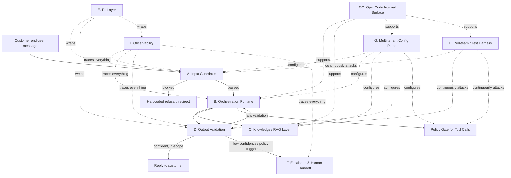

# Neryva Agent Studio - Reference Architecture v1.1

**Status:** Finalized for engineering planning
**Scope:** High-level system architecture for the governance and control layer described in the Neryva Agent Studio product definition
**Grounding:** Every component below is tied to an active open-source project, a peer-reviewed or arXiv paper, a named standard, or a clearly marked commercial/internal dependency. Where a component has no good off-the-shelf answer, that is stated explicitly rather than papered over.

---

## 1. What this document is for

The product definition says Neryva controls the behavior, voice, scope, and workflow fit of a customer-selected LLM, without replacing the model provider or the secure deployment layer.

The first architecture draft tried to do that with a keyword router and a regex validator. That was directionally right, but too weak for enterprise use: no red-teaming, no PII defense in depth, no human handoff, and no explicit side-effect authorization.

This document replaces that draft. It is organized around CoALA (Cognitive Architectures for Language Agents), because the agent architecture problem is not a blank slate. CoALA decomposes an agent into memory, a structured action space, and a decision loop. Here, those ideas are used as a design scaffold, not as theory for theory's sake.

OpenCode is included as an internal developer/operator surface for provider connectivity, tool integration, and workflow prototyping. It is not the customer-facing runtime.

---

## 2. Design principles

1. **The model is not the product; the control layer is.** Neryva must work whether the customer picks Claude, GPT, Gemini, or a compatible self-hosted provider.
2. **No single filter is a security boundary.** All guardrails are probabilistic. The system must assume bypass will happen and use layered controls.
3. **Multi-tenant from day one.** Each enterprise customer gets its own policy, data scope, and knowledge base. Hardcoding a single model, vector DB, or compliance posture is wrong.
4. **Every guardrail is also a test target.** Nothing ships without recurring adversarial testing.
5. **Prefer active tools and communities.** If a tool is archived, commercially gated, or unstable, that has to be explicit.
6. **Internal operator tooling is separate from the customer runtime.** OpenCode can connect to provider APIs, custom endpoints, tools, and MCP servers, but it must remain behind Neryva policy, PII handling, and approval boundaries.

---

## 3. Threat and compliance model

This architecture maps to the OWASP Top 10 for LLM Applications 2025 (v2.0).

| ID | Risk | Primary mitigation |
|---|---|---|
| LLM01:2025 | Prompt Injection | A, C |
| LLM02:2025 | Sensitive Information Disclosure | E, I |
| LLM03:2025 | Supply Chain | G, H, process controls |
| LLM04:2025 | Data and Model Poisoning | C, H |
| LLM05:2025 | Improper Output Handling | D |
| LLM06:2025 | Excessive Agency | B, F, D |
| LLM07:2025 | System Prompt Leakage | A, D |
| LLM08:2025 | Vector and Embedding Weaknesses | C |
| LLM09:2025 | Misinformation | C, H |
| LLM10:2025 | Unbounded Consumption | B |

Two regulatory facts matter:

- The EU AI Act applies from 2 August 2026 in general, while obligations for providers of general-purpose AI models apply from 2 August 2025.
- If Neryva operates as a provider or deployer in scope for an EU customer, documented adversarial testing and evidence retention are part of the governance story, not optional nice-to-haves.

---

## 4. Component architecture

### Component A - Input Guardrails
**CoALA role:** gatekeeper on the perception step, before anything enters working memory.  
**Implements:** OWASP LLM01, LLM07.

- Topic and dialog control: NeMo Guardrails is the default control layer for conversation-level rails.
- Injection and jailbreak detection: use a currently maintained scanner. LLM Guard is archived and should not be used as a load-bearing dependency.
- The point of this layer is to block or redirect obvious failures before the model is even called.

### Component B - Orchestration Runtime
**CoALA role:** the decision loop itself: propose -> evaluate -> select -> execute.  
**Implements:** OWASP LLM06.

- Use LangGraph for the core orchestration model.
- Keep provider-specific logic in adapters so the architecture stays model-agnostic.
- If the production deployment/server package introduces commercial constraints that do not fit the target margin, keep LangGraph core and build a thin custom runtime around it.
- All tool-using branches must route through the policy gate before they can mutate external state.

### Component C - Knowledge / RAG Layer
**CoALA role:** semantic long-term memory.  
**Implements:** OWASP LLM08, LLM09.

- Keep the vector store pluggable.
- Support pgvector for Postgres-first tenants, managed vector DBs for zero-ops tenants, and self-hosted search backends for compliance-sensitive tenants.
- Apply retrieval filtering before content enters the prompt.
- Use spotlighting or equivalent delimiters so retrieved text is clearly treated as data.
- Use RAGAS-style evaluation metrics to measure knowledge base quality and faithfulness.

### Component D - Output Validation
**CoALA role:** internal action - the agent checking its own proposed action before executing it.  
**Implements:** OWASP LLM05.

- Use Guardrails AI plus schema validation for structured outputs.
- Treat any self-reported `is_in_scope` style signal as advisory only.
- Add a separate policy check for any output that would trigger a side effect.
- If a response fails validation repeatedly, escalate instead of looping forever.

### Component P - Policy Gate for Tool Calls
**CoALA role:** internal action authorization before the agent is allowed to mutate external state.

- This is the final authorization check for any side-effecting action.
- It consumes tenant policy from Component G and validation signals from Component D.
- If an action is not explicitly allowed, it must be blocked or escalated.
- This component is the source of truth for tool-call approval, so B only orchestrates and D only validates; P authorizes.

### Component E - PII and Data-Handling Layer
**CoALA role:** cross-cutting constraint on what enters and leaves working memory.  
**Implements:** OWASP LLM02.

- Use Presidio for self-hosted detection and redaction in the request path.
- Pair it with cloud DLP at the logging and storage edge when the customer requires additional defense in depth.
- Redact traces, eval data, and replay corpora before storage or export.
- Do not assume observability is exempt from PII rules.

### Component F - Escalation and Human Handoff
**CoALA role:** an external action that hands control to a human when the model lacks confidence.  
**Implements:** OWASP LLM06 mitigation.

- Use a confidence-threshold-based handoff, not a keyword-only trigger.
- Preserve intent, history, attempted resolution, and recommended next step in the handoff.
- Integrate with the customer's helpdesk or support system of record.

### Component G - Multi-tenant Configuration Plane
**CoALA role:** procedural memory - the rules that govern how the whole system behaves for a given tenant.

- This is Neryva's real product layer, not something to buy off the shelf.
- Version tenant configuration and compile it into rails, validator sets, escalation policy, and knowledge allowlists.
- Treat it as a first-class service with tests, not as scattered YAML.

### Component H - Continuous Red-Teaming and Test Harness
**CoALA role:** feedback and learning applied to guardrail configuration.

- Use Garak for broad automated probing.
- Use PyRIT for multi-turn adversarial testing.
- Use Promptfoo for CI regression testing if the team accepts the current ownership situation; otherwise keep a neutral alternative under evaluation.
- Run the suite on every prompt/config change and on a recurring schedule even when nothing changed.

### Component I - Observability
**CoALA role:** episodic memory - a record of what happened.

- Use Langfuse or LangSmith depending on the team's data-control and deployment preferences.
- Tracing, evals, and incident review should feed red-team coverage.
- Apply PII redaction before trace persistence.

### Component J - OpenCode Internal Surface
**CoALA role:** operator/developer control surface, not part of the customer execution path.

- Use OpenCode for provider setup, model comparison, tool and MCP experiments, prompt iteration, and development-time workflow prototyping.
- OpenCode supports multiple providers, custom endpoints, tools, permissions, plugins, and an ACP/web surface, which makes it useful for implementation work.
- OpenCode sessions are internal work sessions for engineers and operators, not customer sessions and not a tenant-runtime state store.
- Keep it behind Neryva's tenant policies and never let it bypass runtime authorization.

---

## 5. Request lifecycle

1. Customer message arrives at the tenant config resolver, which loads that tenant's rails, validators, and knowledge scope.
2. Component A screens the message: dialog rails, injection/jailbreak detection, and PII pre-redaction run before the model is called.
3. If passed, Component B starts orchestration and pulls context from Component C.
4. The model proposes a response. Component D validates it against schema and policy rules. A failure triggers a bounded re-ask loop.
5. Before any tool call that can mutate external state, Component B routes the action through the policy gate derived from Component G and Component D. If the action is outside the tenant's allowlist, it is blocked or escalated.
6. Component D also carries a confidence score. Below threshold, or on an explicit policy trigger, control passes to Component F.
7. Every step is traced into Component I after redaction where needed. Component H replays sampled production traces as regression tests and runs full adversarial sweeps before any tenant config change ships.

---

## 6. Deployment and multi-tenancy

Two deployment shapes are valid:

- **Isolated per-tenant deployment:** strongest compliance story, highest infrastructure cost.
- **Shared control plane, isolated data plane:** cheaper to operate, harder to sell into regulated accounts.

Given the target customer profile, the architecture should be designed for isolated-per-tenant first, with shared control plane as a later optimization if the commercial shape supports it.

OpenCode stays in the internal build and validation environment. It does not change the customer deployment model.

---

## 7. Verified tool status

| Component | Tool | Status |
|---|---|---|
| A | NeMo Guardrails | Active open-source project |
| A/D | Guardrails AI | Active open-source project |
| A | LLM Guard | Archived, do not use |
| B | LangGraph | Active open-source core; paid deployment/server options exist |
| B | AG2 | Active open-source alternative |
| C | RAGAS | Active open-source evaluation framework |
| E | Presidio | Active open-source PII detection |
| H | Garak | Active red-team harness |
| H | PyRIT | Active red-team harness |
| H | Promptfoo | Open source, but now part of OpenAI |
| I | Langfuse | Active open-core observability stack |
| J | OpenCode | Use as internal tooling; pin the exact distribution you adopt and recheck the active release channel before production lock-in |

---

## 8. Phased build plan

1. **Phase 1 - Config plane + core loop**
   - Build Component G schema and versioning.
   - Build Component B on LangGraph core.
   - Build Component D basic schema validation.
   - Set up OpenCode internally for provider connections, model comparisons, and prompt iteration.
   - Ship against one pilot tenant.

2. **Phase 2 - Guardrails hardening**
   - Add Component A with conversation rails and injection scanning.
   - Add Component E with PII handling.
   - Add Component C retrieval filtering and spotlighting.
   - Run the first Garak/PyRIT sweep before any external pilot.

3. **Phase 3 - Escalation and observability**
   - Add Component F helpdesk integrations.
   - Bring Component I tracing into production.

4. **Phase 4 - Continuous testing operationalized**
   - Run Component H on a recurring schedule.
   - Formalize the isolated-vs-shared deployment decision based on actual customer mix.

---

## 9. Open risks and unresolved questions

- LangGraph deployment/server economics need a real quote or a concrete custom-runtime estimate before implementation locks in.
- Isolated vs. shared multi-tenancy is still a roadmap fork, not a solved choice.
- Promptfoo ownership makes it a soft neutrality risk for a model-agnostic product.
- OpenCode should be pinned to the exact distribution we choose, because the upstream project moved once and we should not assume a single repository will remain the stable source of truth forever.
- Brand and voice consistency still have no clean technical validator. That remains a prompt, workflow, and review problem.
- Guardrail evaluation methodology is still immature industry-wide. Any internal catch-rate claim needs the test set and methodology attached.

---

## 10. References

**Papers**
- Sumers, T., Yao, S., Narasimhan, K., & Griffiths, T. (2023). Cognitive Architectures for Language Agents. arXiv:2309.02427.
- Rebedea, T., Dinu, R., Sreedhar, M., Parisien, C., & Cohen, J. (2023). NeMo Guardrails: A Toolkit for Controllable and Safe LLM Applications with Programmable Rails. arXiv:2310.10501.
- Munoz, G. et al. (2024). PyRIT: A Framework for Security Risk Identification and Red Teaming in Generative AI Systems. arXiv:2410.02828.
- Es, S., James, J., Espinosa Anke, L., & Schockaert, S. (2024). RAGAs: Automated Evaluation of Retrieval Augmented Generation. EACL 2024.
- Greshake, K., Abdelnabi, S., Mishra, S., Endres, C., Holz, T., & Fritz, M. (2023). Not What You've Signed Up For: Compromising Real-World LLM-Integrated Applications with Indirect Prompt Injection. arXiv:2302.12173.
- Hines, K., Lopez, G., Hall, M., Zarfati, F., Zunger, Y., & Kiciman, E. (2024). Defending against indirect prompt injection attacks with spotlighting. arXiv:2403.14720.

**Standards**
- OWASP GenAI Security Project. OWASP Top 10 for LLM Applications 2025 (v2.0). Published Nov 18, 2024.
- EU AI Act and the Commission guidance pages for GPAI obligations and enforcement timing.

**Primary sources**
- https://github.com/NVIDIA-NeMo/Guardrails
- https://github.com/guardrails-ai/guardrails
- https://github.com/langchain-ai/langgraph
- https://github.com/ag2ai/ag2
- https://github.com/microsoft/presidio
- https://github.com/NVIDIA/garak
- https://github.com/microsoft/PyRIT
- https://langfuse.com/
- https://github.com/explodinggradients/ragas
- https://opencode.ai/v2/docs/providers
- https://opencode.ai/v2/docs/models
- https://dev.opencode.ai/docs/tools/
- https://dev.opencode.ai/docs/cli/
